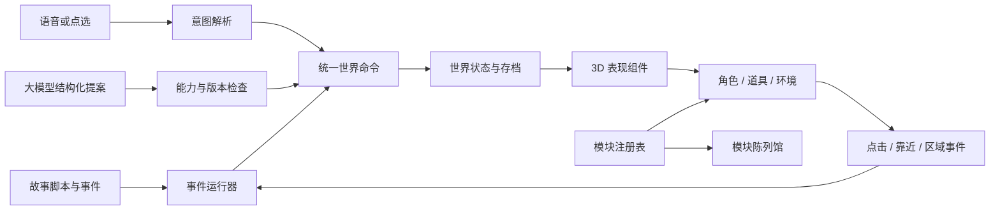

# 萌萌星：脚本、事件与模块架构

本轮把三个当前章节迁到同一套世界命令与事件接口，保留现有 Three.js 画面、语音服务、角色资源和路由。故事仍由各自的流程控制器推进；对象、道具、事件与存档不再依赖具体页面。历史故事、模拟器和已有导入路径继续兼容。

陈列馆：[/dev/modules/](https://jma.mikeywa.site/dev/modules/)。机器可读目录：[/dev/modules/catalog.json](https://jma.mikeywa.site/dev/modules/catalog.json)。目录包含现有模块和历史录制素材，并不表示每项都出现在当前主线。

## 架构设计表

| 层 | 负责什么 | 主要位置 | 后续如何修改 |
| --- | --- | --- | --- |
| 故事内容 | 三章台词、问题、短选项、顺序、分支、事件声明 | `content/stories/` | 改脚本数据；不创建模型、不操作 DOM |
| 彩蛋内容 | NPC 的所在星球、工作、道具、招呼与互动 | `content/encounters.js` | 调整角色点位与对白；沿用角色资源 ID |
| 资源与能力目录 | 哪些模型存在、提供哪些动作、有哪些颜色与语义关键词 | `content/assets.js`、`content/props.js`、`content/characters.js`、`content/worlds.js` | 注册资源及能力；陈列馆自动枚举 |
| 剧情事件运行器 | 场景进入/离开、回答、靠近、区域进入、造物、结束等事件；条件与一次性触发 | `runtime/story-director.js` | 在脚本追加事件规则，不改执行器 |
| 世界状态与命令 | 增删物件、状态/颜色变化、角色动作、环境变化、造物；校验与快照 | `runtime/world-runtime.js`、`runtime/contracts.js` | 新能力先定义契约，再实现表现；一条规则的命令整批校验 |
| 玩家/AI 接口 | 描述当前能力、接收结构化提案、拒绝过期或无效命令 | `runtime/intent-gateway.js`、`features/creation-service.js` | 把语音或模型结果翻译成相同命令 |
| 独立道具模块 | 262 个预制模型，交通与玩具按不同物件类型收录，食物保留既有变体 | `modules/props/*.js` | 独立入口注册；常见造型共用 `modules/collection-model.js`，飞碟、战舰及玩具武器等独立建模 |
| 3D 表现组件 | 装配角色、同步实体、动画、球面位置、碰撞和资源释放 | `presentation/actor-factory.js`、`presentation/world-presenter.js` | 更换造型或动画实现，不改剧本 |
| UI 组件 | 短选项、NPC 对话框、语音状态、台词序列和字幕同步 | `presentation/`、`read-along.js`、`src/voice-input-control.js` | 组件接收数据和回调，不拥有主线进度 |
| 进度与存档 | 稳定场景 ID、脚本版本、世界快照、旧存档迁移 | `runtime/story-progress.js`、`runtime/game-session.js` | 场景保留 ID，可插入、改序或声明下一幕 |
| 陈列与维护 | 可搜索预览、动作试用、音频试听、事件试验、源码入口和 JSON 清单 | `modules/catalog.js`、`modules/gallery.js`、`tools/build-*.mjs` | 构建自动更新目录；新增公共模块未登记会报错 |

## 数据怎么流动



`app.js` 与 `debate.js` 仍负责页面流程装配、输入开放时机和原有后端请求。第一章的颜色/钥匙演出、第二章的四句讨论、第三章的创造评阅是不同玩法，保留各自流程；共用内容契约、世界命令、资源工厂、事件和 UI。历史 `stage.js`/`worlds.js` 继续承载球面渲染与已有场景，不需要为每次改台词而修改它们。

## 改脚本

- 第一章正式 5 回合脚本在 `content/stories/wow.js`，版本 4；原六章绘本数据保留在 `src/wow-story-data.js`，兼容旧绘本。`content/stories/first-light.js` 提供纯数据回应校验。版本 1 存档先备份至 `story.wow.before-first-light` 再开启新版，场景 ID 保留作内容锚点。
- 点选场景用 `tapTarget` 指向演员或脚本实体 ID（如 `wow`、`fl-star`）；舞台提供循环柔光和点击强光，点击与按钮共用回答入口，响应中不重复提交。细丝与镂空模型保留轻微包围盒点击容差；减少动态效果时引导保持常亮。验证入口 `dev/tools/verify-story-tap.mjs`。
- 第二章的话题、角色立场、备用四句台词、开场、反思选项和结尾在 `content/stories/debate.js`。
- 第三章三幕主线内容在 `content/stories/moon.js`。每幕可以单独声明事件与下一幕。
- `next: '某个场景ID'` 可指定下一幕，选项的 `next` 优先于场景的 `next`；`next: 'end'` 结束。没有声明时沿数组顺序推进。
- `id` 是存档身份，改文案不改 ID。新存档按 `sceneId` 恢复，旧数字存档仍可读；当前场景被删时，按上次场景顺序寻找仍存在的前一幕，进入其后一个位置。没有可用锚点则从开头继续。

脚本事件示例：

```js
events: [{
  id: 'welcome-garden',
  on: 'scene.enter',
  once: true,
  effects: [
    { type: 'entity.spawn', id: 'question-garden', asset: 'prop:garden', position: [2, 3], scale: 0.7 },
    { type: 'actor.animate', target: 'ace', animation: 'wave', expression: 'happy' },
    { type: 'environment.set', preset: 'dusk' }
  ]
}]
```

`when: { npcId: 'lingdang', choiceId: 'first' }` 匹配事件参数；`if: { 'bridge-ready': true }` 匹配故事旗标。旗标由脚本的 `flag.set` 设置。`once` 的执行记录随存档保存，刷新不会重复增加物件。完整可运行示例在 `content/examples/event-playground.js`，由陈列馆实际执行。

| 已接通的事件 | 参数 |
| --- | --- |
| `scene.enter` / `scene.exit` | `sceneId` |
| `answer.accepted` | `sceneId`，点选时可含 `choiceId` |
| `creation.saved` | `creationId`、`modifying` |
| `encounter.enter` / `encounter.choice` | `npcId`，选择时含 `choiceId` |
| `zone.enter` | `zone` |
| `entity.interact` | `entityId` |
| `story.completed` | 无 |
| `debate.ready` / `debate.completed` | 无 |

效果字段可以用 `$event.entityId` 或 `$event.creationId` 引用本次事件参数。引用是精确字段替换，不执行字符串表达式。每条规则的全部命令先在副本上校验，通过后再更新存档和画面。不同规则按书写顺序执行；不保证多条独立规则之间的整体事务。

## 新增一块积木

1. 在 `modules/props/` 新建一个模型文件，导出 `build(toolkit)`，参考 `windmill.js`。模型只能使用共享工具和自己的部件，不读取故事、DOM 或存档。
2. 在 `modules/props/registry.js` 登记工厂，在 `content/props.js` 登记名称、关键词、实际动画反馈、默认伙伴。能力清单从这里生成。
3. 工具箱管理几何与材质所有权，模型实例统一提供 `group`、`trigger()`、`setState()`、`update()`、`dispose()`。现有状态为 `idle` / `working` / `active`；动画为 `activate`。特殊能力需先扩展契约和执行器，不能只写一句未实现的反馈。
4. 运行构建。新道具自动出现在陈列馆和 JSON 清单，词义识别、世界命令与 UI 使用同一个 ID。
5. 确认桌面与手机预览，以及动画结束/移除后的清理。几何/材质不跨实例随意共享，避免释放一个作品影响另一个。

角色沿用 `npc:<id>`、`yellow:<id>`、`clay:<id>`、`wow:<id>`；道具使用 `prop:<id>`。表现层统一装配，不把模型函数塞回剧情文件。预制物件位置使用球面局部 `[x,z]` 坐标（每轴 -9 到 9），比例限制为 0.2–1.5；每个世界最多 300 个脚本实体，新增超出时自动移除最早生成的物件。`createdOrder` 记录生成顺序，存档恢复保留顺序；同 ID 更新不会触发回收。容量计划与散落共用 `capacityEvictions`，失败批次不回收旧物件。孩子作品最多 12 件，每件最多三个部件。

陈列馆的自然语言生成在提交前经 `modules/scatter.js` 分配随机球面位置：从实际模型包围盒测量水平占地，检查已有实体及同批模型的距离，空间不够整批拒绝。批量超过 32 个时单体缩小到 0.36。只对新生成实体分配点位，位置写入世界命令，渲染/恢复不重掷。此检查不覆盖星球自带装饰或任意大幅后续动画。桌面左键旋转、右键平移；陈列馆手形按钮切换单指平移，双指保留缩放。

## 语音与大模型

场景控制保留 1–100 的明确数量。未知造物按类别近似替代（如榴莲→菠萝）；无类别线索时用皮球，并返回 `substitution` 说明原始输入、替代对象、数量与原因。无配置、上游失败或空提案也走近似兜底，控制台明确标识，不能冒充精确命中。目录构建先写临时文件再原子替换，避免请求读到部分 JSON。

当前第三章的语音/文字造物已改为“解析意图 → 创建命令 → 世界运行器”，沿用现有语音识别。模型侧新增的是可接入的操作契约：后续模型调用先取得 `session.gateway.describe()` 的当前场景、能力和上下文版本，再返回：

```json
{
  "version": 1,
  "context": "原样返回 describe() 提供的当前 context",
  "commands": [
    { "type": "entity.spawn", "id": "new-windmill", "asset": "prop:windmill", "position": [2, 2], "scale": 0.7 },
    { "type": "entity.animate", "id": "new-windmill", "animation": "activate" }
  ]
}
```

交给 `session.gateway.apply(proposal)`，返回成功版本或具体错误。命令必须来自已注册能力；旧场景、重启前、被重复使用的版本会拒绝。模型不具有脚本旗标修改权。一次最多 100 条命令（声明式事件仍限 32 条效果），不接收 JS、HTML、外部模型地址或任意属性路径。

既有 AI 服务仍使用原有接口；新的“模型直接发世界操作提案”由此接口接入，尚未给线上模型增加自主操作世界的服务端工具。可以先在陈列馆的提案试验区验证生成结果，再接模型。

## 存档和生命周期

- 原 `jma.dev.clay.v1.story.*` 键保留。新字段 `worldState` 保存版本化世界快照；`creations` 是兼容旧页面读取的派生镜像，业务写入只走命令运行器。
- 老的 `creations` 会经过模型、颜色、伙伴、位置检查后导入。无效记录被忽略，不执行任意对象字段。
- 一次性事件记录保存在快照中。动作为短时表现；实体、工作状态和环境可恢复。
- 场景退出释放实例和碰撞体，事件监听由组件所有者清理；旧请求通过场景 token 隔离。陈列馆使用独立内存会话，不写入玩家故事进度。
- 自然语言造物索引同时收录道具与所有角色，精确角色名称先于未知物件替代。陈列馆优先在当前画面紧凑落位，失败时按星球尺寸自动重新取景、选择有空间的朝向并降低本批比例；密集模式允许包围圈接触，不承诺精确网格无穿插。相邻实体落地触发角度冲量及阻尼回正，这是轻量接触反馈而非刚体堆叠求解；减少动态效果时禁用，清场后随实例释放。
- 浏览器本地存档不会跨设备同步。

## 陈列馆维护规则

UI 与逻辑的公共模块登记在 `modules/catalog.js`；角色、道具、场景和彩蛋从真实资源表枚举。`tools/build-audio-catalog.mjs` 扫描 `assets/` 下的 MP3、WAV、OGG、M4A，自动生成音频目录，播放前不会下载音频。陈列馆只使用一个 3D 舞台，切换时释放旧实例。

构建输出 `modules/catalog.json`，供 AI 不打开浏览器也能读取条目、源码位置、依赖与能力。`verify-module-catalog.mjs` 核对目录与源码、资源、道具工厂的一致性。公共 `runtime/`、`presentation/`、`features/` 模块未登记，或新道具漏注册，构建失败。维护要求同时写入本目录 `AGENTS.md`。

## 构建与验证

```sh
node dev/tools/build.mjs
node dev/tools/verify-game-runtime.mjs
node dev/tools/verify-curiosity-worlds.mjs
node dev/tools/verify-answer-support.mjs
node dev/tools/verify-exploration.mjs
PLAYWRIGHT_MODULE=/path/to/playwright-core/index.mjs node dev/tools/verify-curiosity-ui.mjs
PLAYWRIGHT_MODULE=/path/to/playwright-core/index.mjs node dev/tools/verify-module-ui.mjs
```

游戏浏览器验证使用受控离线 API，覆盖三章的操作与恢复；不等同于物理麦克风验收。陈列馆检查实际模型、真实音频加载/停止、UI 复用、环境和实体增删、无效命令与过期提案，以及手机布局。

## GitHub 参考与选型

| 项目 | 核对到的设计 | 这次采用的做法 |
| --- | --- | --- |
| [Koota](https://github.com/pmndrs/koota) | ECS 状态、traits、动作与增删事件；仓库提供 AI agent skill | 用能力数据和动作入口组织对象；当前规模用轻量注册表实现 |
| [three-game-engine](https://github.com/WesUnwin/three-game-engine) | Three.js 的场景、GameObject、prefab 与 JSON 项目描述 | 拆开资源工厂、可序列化内容和运行实例 |
| [XState](https://github.com/statelyai/xstate) | 状态机、事件、actor，用于复杂流程 | 明确生命周期、事件和可取消的对话边界 |
| [3JSE](https://github.com/xirtus/3JSE) | README 提出编辑器、代码、图形脚本和 AI 共用可序列化表示与命令接口 | 玩家输入和 AI 提案进入同一命令运行器 |

以上是针对本项目现有原生 JS、Three.js 与已上线故事的设计取舍。此次没有引入这些库，也没有复制它们的实现；不将仓库自述当作生产成熟度保证。当前规模优先保留现有渲染与角色，使用项目内的小型运行层；后续实体数量和查询复杂度显著增加时，再单独评估 ECS 依赖。

## 脚本创作工作台

陈列馆的三章脚本条目和“脚本创作工作台”提供真实内容的可视化编辑，实现在 `modules/story-editor.js`。场景、对白、问题、选项去向和事件分区呈现；原有未知字段保留，原场景 ID 不变。第二章使用专用的话题与反思编辑视图；备用四句对白由函数生成，目前只读。

编辑副本保存在 `jma.author.draft.v1.<源故事>`，每个源故事一个草稿；复制创作分配新故事 ID，继续使用该草稿槽位，保留多份作品请分别导出。JSON 导入和导出检查事件结构、场景身份、选项身份和跳转引用。文本分支预演不调用 AI、不执行世界事件、不写玩家存档。导出的是展开后的纯数据，接入正式游戏仍需开发者注册内容、检查世界命令并执行游戏验证；第二章备用台词函数不能直接用 JSON 覆盖。

第一束光的语音回应通过 `/api/wow-turn` 的 `first-light` 策略承接原词，离线也可推进；私密与危险内容不复述。画面使用本地程序化造型和原话文字卡，并非在线 AI 生图。点选取代两次拖拽；减少动态效果设置保留亮光但关闭摇晃。

第一章 v4 的工作台草稿使用 `jma.author.draft.v1.wow.first-light`，原 v1 草稿保留，避免旧稿自动覆盖新版 5 回合。

## 第一章的模型组合

`content/stories/first-light-models.js` 声明预设选项对应的普通实体命令，`wow.js` 将它们纳入场景事件。语音与点选通过同一选项映射，彩虹／粉色天空与小鱼／棉花糖使用不同实体 ID，可组合保留。进入场景按稳定 ID 和已保存回答重建目标模型；已有 v2 存档也能补齐模型。14 个道具均为独立 `modules/props/` 模块，统一登记、清理，并可在陈列馆试用。悬空模型声明 `group.userData.suspended`，表现层不让它落地或阻挡地面行走；运行器仍使用原有实体契约。

## 成组召唤与同类多样化

`content/scene-groups.json` 维护角色组别名、成员和父母/伙伴关系；IP 关系以所列钉钉原文为依据，用户约定的“叫叫家族”指小分队，“叫叫全家”指父母与叫叫。黄色四巨头使用 `yellow:` 模型。`scene_groups.py` 在场景关键词解析时展开组，动作沿用当前实体命令，不自动新增；目录中的 category、tags、variety 用于挑选不同类型，并优先当前没有的模型。未指定数量的同类“一些”默认五个，角色组默认全员；种类不足时明确说明，不拿同款变体充当不同种类。验证入口为 `dev/tools/verify-scene-groups.py` 及陈列馆 AI 控制台。

### 多对象与进食

`scene_interactions.py` 优先按各名词前的数量解析多对象，输出多组 spawn 与 `feeding.start`，一次新增总数仍上限 100。运行器校验角色和可食用目标后统一提交；`presentation/feeding-controller.js` 独占分配最近目标，在落地完成后移动、咀嚼两次，再经会话回调提交食物移除与角色位置。切换场景、移除角色及 feeding.stop 清理任务；食物消耗写入存档，暂态动作不自动恢复。

### 明确尺寸与颜色

`scene_appearance.py` 将正常/大/超大/倍数映射为标准尺寸的 1/1.5/2.5/指定倍数；标准 scale 为 0.65。显式尺寸设置 sizeLocked，自动布局不得缩小；`entity.scale` 与 `entity.color` 作用于已有对象，颜色覆盖保留五官明暗与蓝底黄星旗帜。尺寸与颜色标记进入存档，正常尺寸恢复为 0.65。

## 英语社群章节与 R 线模型

`words.html` 是独立入口，复用 `DioramaStage`、`StoryVoice`、`createGameSession` 和统一麦克风 UI。`content/word-games.js` 声明 3～5、6～7、8～10 岁三档内容；孩子用步进器选择具体年龄，每次只推荐一章，继续后直接进入该章。3/5 岁机器人、4 岁颜色、6 岁运动、7 岁玩具、8/9 岁花园、10 岁押韵。每章每档六轮，共 108 轮：逐词搭句、两轮递进填空、三轮自由创作。`word-progress.js` 只记录表达与词语覆盖，不作发音评分；第一轮累计完整句子的词，填空轮要求当次表达，自由轮支持换对象和动作。

`content/rline-nouns.js` 保留钉钉 R1/R2 原词、课次、词义和具象化说明：155 个名词、单独标记的 poop 创作扩展，以及不纳入名词库的词性清单。每词一个 `modules/props/rword-*.js` 工厂入口，共用 `modules/rline-models.js` 的造型工具，单独登记到陈列馆“R 线名词模型库”。同义拼写 mom/mum 合并；foot/feet 单词模型分开，游戏中的 two feet 映射为两只单脚，避免生成两对脚。`creation-catalog.js` 保留主章节原配方优先级，不因 R 线同名词改变已有存档与伙伴选择。

`word-intent.js` 将中英文对象、颜色、数量、属性、动作和空间关系翻译为受限命令。所有命令经 `intent-gateway` 校验后进入运行器；词库外意图调用现有 `/api/scene-control`，仍需资源白名单和场景令牌校验，不执行返回代码，近似造型明确告知。`entity.effect` 与 `entity.attach` 分别管理可组合效果和对象关系，拒绝不存在对象、自身附着及关系环。`presentation/word-effects.js` 负责长大、缩小、伸长、表情、湿润、速度、跳跃、飞行、旋转和组装跟随；模型自身动画与词语效果使用分层变换，离场释放装饰资源，遵守减少动态效果设置。

进度独立保存在 `jma.word-play.v1`，按年龄档及章节分槽，旧主线存档不迁移。完成页从实际 3D 画面生成图片，分享链接的 `#make=` 携带 v2 世界快照；接收端经运行器清理恢复颜色、数量、位置、效果和附着关系，不重新随机摆放。分享不包含录音，也没有云端作品存储或社群排行榜。部署后才可用公网链接邀请他人，本地地址不对其他设备开放。微信里的录音权限、分享卡片和真实儿童口音仍需真机验收。

验证：`verify-word-curriculum.mjs`（108 轮与进度），`verify-word-game.mjs`（句意、原章节同名回归、组合命令、恢复、真实变换），`verify-rline-models.mjs`（原表覆盖、几何、独立资源与释放），`verify-rline-models-ui.mjs`（156 个实际 WebGL 模型），`verify-word-ui.mjs`（年龄推荐、六轮、权限拒绝、恢复、图片、分享与手机）。源表核验用 `RLINE_SOURCE_FILE` 指定原钉钉导出 JSON；浏览器验证用 `PLAYWRIGHT_MODULE` 和 `QA_ORIGIN` 指定环境。


### 词语行为事件与临时道具

`content/behavior-events.js` 是互动定义和陈列馆表格的同一份内容：34 种短表演、13 组符号/状态，再加已有的动作和颜色尺寸。`word-intent.js` 同时服务英语章节和世界工坊；文档内的词语事件在本地确定性解析，其余世界、镜头与群体指令仍调用原场景接口。语音转写与文字进入相同入口，命令仍经 `intent-gateway` 校验。

`entity.event` 接受已登记 action、当前场景中的主体/可选对象、2～20 秒时长和可选两种混合色。它是短暂表演，不把进行中的道具或动画计时写入存档。`behavior-controller.js` 为缺少道具的事件创建私有预制模型，游泳优先复用水池，航行优先复用指定/已有飞机或船，否则默认飞机；结束、停止、更换事件、移除对象、切换世界时释放临时模型、材质和几何。已有对象保留。游泳留下 wet 状态；清洁完成提交 dry；混色结果通过 entity.color 写回，均经过运行器。

哼唱使用头顶音符；睡觉与 sleepy 使用 Z 字符，sleepy 另带闭眼表情。`event-symbols.js` 用立体线段构建符号，无字体依赖；减少动态效果保留符号并取消漂动。读书、绘画、猜物、编织、烘烤等是固定的可见短表演，不宣称自由绘画、任意故事朗读或开放任务推理。自动道具不会作为用户的永久模型保存。

验证入口：`node dev/tools/verify-behavior-events.mjs` 覆盖已登记例句、命令原子性、几何、道具复用/释放、移除/停止和符号；`dev/tools/verify-behavior-ui.mjs` 通过真实界面检查表格点击、无后端词语输入、泳池/飞机、结束/中断及手机布局。

### 沉浸式英语冒险

`words.html` 全屏承载共享 3D 舞台。欢迎、推荐、游戏及结束场景通过圆形遮罩切换，句子之间保留孩子的作品。`presentation/word-text.jsx` 封装 Calligraph 1.4.1 Slots 年龄数字和 Text 发散字幕，字体为本地 MohrRounded Bold；卸载时释放 React root 与偏好监听，减少动态效果时静态呈现。

年龄确认手势提前解锁音频；推荐卡显示 3 秒开始倒计时，到时自动进入，点击“开始”可立即进入。进场自动使用温柔英文女声示范；示范结束再鼓励开口，麦克风权限只在主动点击时申请。仅开放共享语音组件与点词菜单，菜单点击直接提交，保留整句与逐词识别。`acceptsEnglishUtterance` 在本小游戏入口拒绝中文和中英混说，且不调用造物或 AI 接口；播报为英文，中文统一用于题干引导和底部单行最新状态。共享解析器仍支持工坊的中英文输入。

机器人零件铺保留旧 `monster` 章节及存档 ID，独立 `robot-body/head/hand/foot` 模型进入资源注册与通用装配命令；载入该章旧存档时只迁移章节自身 `wg-*` 机械部位，不改词库原模型。验证浏览器脚本覆盖新流程、英文过滤、点词、声音生命周期、单卡推荐、存档和手机排版。

领读字幕通过 `StoryVoice.say(..., onProgress)` 请求真实服务端时间戳，按 AudioContext 播放时间逐词发光并轻微放大；无时间戳不猜测进度。重复听、单词领读、取消和离场都清理高亮。录音失败以错误代码区分权限、设备、空转写和识别服务异常。`tools/word-voice-check.html` 在开发浏览器内用英文音频经真实采样与服务验证本地配置，不读取物理麦克风。

### 英语领读与短反馈

`word-narration.js` 使用真实朗读单词范围，经 `planWordIntent` 和统一 gateway 驱动场景；不提交孩子答案、不改变学习进度。`entity.cue` 是不落盘的有限短反馈，支持 mention（跳两下）、put-in（上方落入已经绑定的容器）与 cancel。`word-effects.js` 用独立变换层组合短反馈与持续状态；放入关系仍由 `entity.attach` 保存。重复名词复用已有实体，句子完整表达目标容器才执行下落。减少动态效果时直接完成放置。

`word-scene.js` 以 `demo-` 身份隔离领读实体，孩子的 parser/AI 上下文只包含自己的实体；数量、颜色和附着关系互不作用。随机落点分别位于示范与创作区域，候选点避让已有模型和背景道具，排除被背景遮挡的落点，画幅不足时平滑拉远镜头；保存和恢复不重排位置。空 ASR 或未知英语的兜底生成一个独立便便，不将其记为作答完成；静音、中文和录音权限故障保持原处理。字幕逐词包裹 Calligraph Text，名词和形容词下以渐变虚线标明可替换；每 6.5 秒在空闲时变换示例。宫格菜单以有限动画管理展开/收起，关闭期间 inert，重试位于左上角。happy 的双眼和笑嘴沿模型正面射线贴合，随模型变换并释放几何。


英语小游戏点词菜单保持展开，通过可取消的飞词动画与顺序队列提交输入；离开关卡清理队列。继续按钮位于用户字幕上方正中间。`word-realtime-voice.js` 作为 `StoryVoice` 的实时适配器，经同源 `/api/word-realtime` 连接服务器端豆包端到端协议桥；识别结果仍经词语意图和运行时校验。默认使用实时语音，显式 `voice=legacy` 或菜单选择可回退经典方案。服务端 `VOLC_REALTIME_API_KEY` 优先于旧应用凭证，密钥不进入浏览器或发布包。朗读通过实时会话的 300 事件发送，支持没有前置识别结果的进场示范；350 可能为空字幕，351 才携带正文，显式朗读不能因此被静音。会话采用 keep_alive 输入模式。英文资源热词由构建从资源词典生成 `content/speech-vocabulary.json`，旧 ASR 与实时会话共享。

英语小游戏使用独立 continuousListening 用户意愿状态：表达处理后和前后翻页领读结束自动恢复，主动暂停、离开游戏和隐藏页面停止。重新选择年龄开始会清空小游戏 journeys、生成世界、语音实例与临时表达队列，保留站点其他模块数据。页码支持悬停、触摸点按和键盘显示上一关。

## 英语小游戏欢迎与音频

`word-welcome.js` 只从英文提取昵称与 3–10 岁年龄，昵称在当前页面内存使用，不写存档。当前入口直接调用 `renderAge()`，`renderIntro()` 的启动调用暂时注释，完整欢迎实现保留以便恢复。恢复后使用已有 `npc:domi` 通过实体命令显示小号 DOMI，欢迎会话优先走实时对话，连接失败保留经典识别/朗读。跳过和重新选年龄走原年龄页，开始时释放欢迎语音并清理旧世界。服务端 onboarding 模式只允许询问昵称和年龄，其余模式仍禁止索取个人资料。

`word-music.js` 使用三首作者标记 CC0 的本地纯音乐，首个手势后播放，静音偏好独立保存；录音、领读、后台时暂停，新一轮随机且避开上一首。来源、许可链接与原始文件哈希在 `assets/music/word-world/licenses.json`。字幕候选由 `createWordSuggestions` 保持固定词槽，每 12 秒仅变化一个，点击词槽重置计时；朗读中冻结，遵守减少动态效果设置。

### 英语世界环境与自主活动
`word-ambience.js` 通过现有 gateway 派发晴雨雪和有限角色表演，每轮 7 秒后释放；显式指令抢占自主表演，保护近期指令、示范模型、附着物和正在运动的角色。手动镜头操作暂停自动运镜 15 秒，减少动态偏好下关闭自动运镜和自主走动。`group.patrol` 可选 speed/distance 经契约限幅，默认行为不变。

小游戏通过 `continuousMeter` 保持已获许可的麦克风音量监测，其他章节维持原采集策略；领读期间只监测音量，避免把播放内容当作孩子答案。麦克风使用六点波形，识别等待独立显示在字幕区域，暂停和离页释放采集。`WORD_PRAISES` 声明六句英文鼓励，匹配后随机选择并避免连续重复，使用领读女声；完成或取消后按当前关卡与用户收音意愿恢复。

小游戏已取消模糊和截图覆盖层，始终直接显示清晰场景。前两轮只自动播放中文提示，孩子英文输入后再造物；主动点喇叭或连续两次未完成时才示范当前完整表达。中文过滤在两种语音入口共用 `createWordLanguageGate`，提取混合语句中的英文；按实际语音段累计 12 秒中文、间隔 45 秒提醒，超过 8 秒无声重置连续性。继续按钮在已通过且持续收音时静音 3 秒自动翻页，声音重置、处理/朗读/菜单/暂停冻结。验证 `verify-word-language.mjs`、`verify-word-opening-ui.mjs`、`verify-word-countdown.mjs`。

Domi 的三段欢迎语由 `wow-child` 专属童声合成并使用新版 API Key，实时识别保持连接；第二句问年龄始终显式请求播放。课堂继续使用实时女声。通用 `/api/tts` 的 realtime 请求在有新版 Key 时通过端到端 300 事件取回 PCM 并封装 WAV，保留旧接口调用方和录音资源；wow-child 保持专用童声路径。

题干的 `createWordSuggestions` 维护可替换词位置和已确认标记：识别先匹配原词/当前词，再将同类替代词放入对应位置；已确认词浅绿且退出自动轮换，手动点词仅清除该位置的确认。快照随本关进度保留，喇叭读取当前完整句。提示与状态在收音上方同一行轮播。前两轮不显示或轮换彩虹虚线，第三轮中文介绍后启用。

小游戏 `focusWordEvent` 对已执行成功的新模型/动作选择最新对象，镜头适度拉近至 1.3 并锁定世界空间三维中心；入场期间先看落点，模型稳定后跟随移动。手动拖动释放锁定，新场景清理；其他模块的二维跟随契约保持兼容。实时课堂语速为 -40，经典备用合成以 readingSpeed=.65 作用于 gentle 音色，童声不变。应用领读通过 wordPauses 将英文单词以逗号分隔，仍以一次整句请求播放；中文应用提示单独带 wordPrompt，用户中文输入继续静默过滤。验证 `verify-word-caption.mjs`、`verify-word-focus-ui.mjs`。


### 主题词汇扩展（2026-09-24）

`content/word-expansion.js` 提供海底、露营和冰雪三个主题，各含三档年龄的六轮内容。九章共 162 个主例句，原章节与课次 ID 保持不变。`RLINE_EXTENSIONS` 中 12 个新名词带 `extension: true` 和空原课次，不冒充原 R 线来源；独立模型入口、热词、复数识别与字幕替换词同步登记。推荐仅保留一个主题卡，通过本次会话的上一主题轮换，不保存语音或学习记录；新动词形容词提案见 `docs/word-event-expansion-proposal.md`，首批 push/pull/throw/kick/hide 与 cold/hungry/thirsty/dirty 已接入，其余仍待确认。验证入口：`dev/tools/verify-word-expansion.mjs` 与 `dev/tools/verify-word-expansion-ui.mjs`。

### 六步入门流程与容错（2026-09-24）

九章三档年龄均为单名词、另一个名词、数量加名词、颜色加名词、大小加颜色加名词、最后完整句。课次 ID 保持稳定；旧的丰富例句保存在 `WORD_SENTENCE_LIBRARY`，扩展词仍通过词菜单和替换候选可玩。每章前两轮由中文提问引导，第三轮用中文介绍彩虹虚线；中文仅为应用脚本播报，儿童输入仍只执行提取后的英文。无需先点 Domi，默认选年龄。

`normalizeWordAttempt` 对当前题干内至多一个未知词做保守拼写修正，支持少量常见同音转写；已知有效词不会被改成题干词。缺冠词不阻止完成，不把文本匹配称为发音评分。`verify-word-teaching-ui.mjs` 检查逐步教学、无模糊、换词、连续收音、六轮完成和重选清理；`verify-word-tolerance.mjs` 检查容错与创意词保留。
