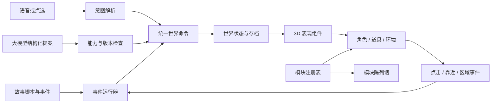

# 萌萌星：脚本、事件与模块架构

本轮把三个当前章节迁到同一套世界命令与事件接口，保留现有 Three.js 画面、语音服务、角色资源和路由。故事仍由各自的流程控制器推进；对象、道具、事件与存档不再依赖具体页面。历史故事、模拟器和已有导入路径继续兼容。

陈列馆：[/dev/modules/](https://jma.mikeywa.site/dev/modules/)。机器可读目录：[/dev/modules/catalog.json](https://jma.mikeywa.site/dev/modules/catalog.json)。目录包含现有模块和历史录制素材，并不表示每项都出现在当前主线。

## 架构设计表

| 层 | 负责什么 | 主要位置 | 后续如何修改 |
| --- | --- | --- | --- |
| 故事内容 | 三章台词、问题、短选项、顺序、分支、事件声明 | `content/stories/` | 改脚本数据；不创建模型、不操作 DOM |
| 彩蛋内容 | NPC 的所在星球、工作、道具、招呼与互动 | `content/encounters.js` | 调整角色点位与对白；沿用角色资源 ID |
| 资源与能力目录 | 哪些模型存在、提供哪些动作、有哪些颜色与语义关键词 | `content/assets.js`、`content/props.js`、`content/characters.js`、`content/worlds.js` | 注册资源及能力；陈列馆自动枚举 |
| 剧情事件运行器 | 场景进入/离开、回答、靠近、区域进入、造物、结束等事件；条件与一次性触发 | `runtime/story-director.js` | 在脚本追加事件规则，不改执行器 |
| 世界状态与命令 | 增删物件、状态/颜色变化、角色动作、环境变化、造物；校验与快照 | `runtime/world-runtime.js`、`runtime/contracts.js` | 新能力先定义契约，再实现表现；一条规则的命令整批校验 |
| 玩家/AI 接口 | 描述当前能力、接收结构化提案、拒绝过期或无效命令 | `runtime/intent-gateway.js`、`features/creation-service.js` | 把语音或模型结果翻译成相同命令 |
| 独立道具模块 | 20 个预制模型，各自的结构和可动部件 | `modules/props/*.js` | 新物件增加一个文件并注册；不改故事入口 |
| 3D 表现组件 | 装配角色、同步实体、动画、球面位置、碰撞和资源释放 | `presentation/actor-factory.js`、`presentation/world-presenter.js` | 更换造型或动画实现，不改剧本 |
| UI 组件 | 短选项、NPC 对话框、语音状态、台词序列和字幕同步 | `presentation/`、`read-along.js`、`src/voice-input-control.js` | 组件接收数据和回调，不拥有主线进度 |
| 进度与存档 | 稳定场景 ID、脚本版本、世界快照、旧存档迁移 | `runtime/story-progress.js`、`runtime/game-session.js` | 场景保留 ID，可插入、改序或声明下一幕 |
| 陈列与维护 | 可搜索预览、动作试用、音频试听、事件试验、源码入口和 JSON 清单 | `modules/catalog.js`、`modules/gallery.js`、`tools/build-*.mjs` | 构建自动更新目录；新增公共模块未登记会报错 |

## 数据怎么流动



`app.js` 与 `debate.js` 仍负责页面流程装配、输入开放时机和原有后端请求。第一章的颜色/钥匙演出、第二章的六轮辩论、第三章的创造评阅是不同玩法，保留各自流程；共用内容契约、世界命令、资源工厂、事件和 UI。历史 `stage.js`/`worlds.js` 继续承载球面渲染与已有场景，不需要为每次改台词而修改它们。

## 改脚本

- 第一章台词的原始来源仍是 `src/wow-story-data.js`，兼容旧绘本；3D 配置在 `content/stories/wow.js`。原始场景可加 `inputMode`、`world`、`next` 和 `events`，适配器会保留。
- 第二章的话题、角色立场、备用六轮台词、开场、反思选项和结尾在 `content/stories/debate.js`。
- 第三章六幕内容在 `content/stories/moon.js`。每幕可以单独声明事件与下一幕。
- `next: '某个场景ID'` 可指定下一幕，选项的 `next` 优先于场景的 `next`；`next: 'end'` 结束。没有声明时沿数组顺序推进。
- `id` 是存档身份，改文案不改 ID。新存档按 `sceneId` 恢复，旧数字存档仍可读；当前场景被删时，按上次场景顺序寻找仍存在的前一幕，进入其后一个位置。没有可用锚点则从开头继续。

脚本事件示例：

```js
events: [{
  id: 'welcome-garden',
  on: 'scene.enter',
  once: true,
  effects: [
    { type: 'entity.spawn', id: 'question-garden', asset: 'prop:garden', position: [2, 3], scale: 0.7 },
    { type: 'actor.animate', target: 'ace', animation: 'wave', expression: 'happy' },
    { type: 'environment.set', preset: 'dusk' }
  ]
}]
```

`when: { npcId: 'lingdang', choiceId: 'first' }` 匹配事件参数；`if: { 'bridge-ready': true }` 匹配故事旗标。旗标由脚本的 `flag.set` 设置。`once` 的执行记录随存档保存，刷新不会重复增加物件。完整可运行示例在 `content/examples/event-playground.js`，由陈列馆实际执行。

| 已接通的事件 | 参数 |
| --- | --- |
| `scene.enter` / `scene.exit` | `sceneId` |
| `answer.accepted` | `sceneId`，点选时可含 `choiceId` |
| `creation.saved` | `creationId`、`modifying` |
| `encounter.enter` / `encounter.choice` | `npcId`，选择时含 `choiceId` |
| `zone.enter` | `zone` |
| `entity.interact` | `entityId` |
| `story.completed` | 无 |
| `debate.ready` / `debate.completed` | 无 |

效果字段可以用 `$event.entityId` 或 `$event.creationId` 引用本次事件参数。引用是精确字段替换，不执行字符串表达式。每条规则的全部命令先在副本上校验，通过后再更新存档和画面。不同规则按书写顺序执行；不保证多条独立规则之间的整体事务。

## 新增一块积木

1. 在 `modules/props/` 新建一个模型文件，导出 `build(toolkit)`，参考 `windmill.js`。模型只能使用共享工具和自己的部件，不读取故事、DOM 或存档。
2. 在 `modules/props/registry.js` 登记工厂，在 `content/props.js` 登记名称、关键词、实际动画反馈、默认伙伴。能力清单从这里生成。
3. 工具箱管理几何与材质所有权，模型实例统一提供 `group`、`trigger()`、`setState()`、`update()`、`dispose()`。现有状态为 `idle` / `working` / `active`；动画为 `activate`。特殊能力需先扩展契约和执行器，不能只写一句未实现的反馈。
4. 运行构建。新道具自动出现在陈列馆和 JSON 清单，词义识别、世界命令与 UI 使用同一个 ID。
5. 确认桌面与手机预览，以及动画结束/移除后的清理。几何/材质不跨实例随意共享，避免释放一个作品影响另一个。

角色沿用 `npc:<id>`、`yellow:<id>`、`clay:<id>`、`wow:<id>`；道具使用 `prop:<id>`。表现层统一装配，不把模型函数塞回剧情文件。预制物件位置使用球面局部 `[x,z]` 坐标（每轴 -9 到 9），比例限制为 0.2–1.5；每个世界最多 32 个脚本实体，孩子作品最多 12 件，每件最多三个部件。

## 语音与大模型

当前第三章的语音/文字造物已改为“解析意图 → 创建命令 → 世界运行器”，沿用现有语音识别。模型侧新增的是可接入的操作契约：后续模型调用先取得 `session.gateway.describe()` 的当前场景、能力和上下文版本，再返回：

```json
{
  "version": 1,
  "context": "原样返回 describe() 提供的当前 context",
  "commands": [
    { "type": "entity.spawn", "id": "new-windmill", "asset": "prop:windmill", "position": [2, 2], "scale": 0.7 },
    { "type": "entity.animate", "id": "new-windmill", "animation": "activate" }
  ]
}
```

交给 `session.gateway.apply(proposal)`，返回成功版本或具体错误。命令必须来自已注册能力；旧场景、重启前、被重复使用的版本会拒绝。模型不具有脚本旗标修改权。一次最多 32 条命令，不接收 JS、HTML、外部模型地址或任意属性路径。

既有 AI 服务仍使用原有接口；新的“模型直接发世界操作提案”由此接口接入，尚未给线上模型增加自主操作世界的服务端工具。可以先在陈列馆的提案试验区验证生成结果，再接模型。

## 存档和生命周期

- 原 `jma.dev.clay.v1.story.*` 键保留。新字段 `worldState` 保存版本化世界快照；`creations` 是兼容旧页面读取的派生镜像，业务写入只走命令运行器。
- 老的 `creations` 会经过模型、颜色、伙伴、位置检查后导入。无效记录被忽略，不执行任意对象字段。
- 一次性事件记录保存在快照中。动作为短时表现；实体、工作状态和环境可恢复。
- 场景退出释放实例和碰撞体，事件监听由组件所有者清理；旧请求通过场景 token 隔离。陈列馆使用独立内存会话，不写入玩家故事进度。
- 浏览器本地存档不会跨设备同步。

## 陈列馆维护规则

UI 与逻辑的公共模块登记在 `modules/catalog.js`；角色、道具、场景和彩蛋从真实资源表枚举。`tools/build-audio-catalog.mjs` 扫描 `assets/` 下的 MP3、WAV、OGG、M4A，自动生成音频目录，播放前不会下载音频。陈列馆只使用一个 3D 舞台，切换时释放旧实例。

构建输出 `modules/catalog.json`，供 AI 不打开浏览器也能读取条目、源码位置、依赖与能力。`verify-module-catalog.mjs` 核对目录与源码、资源、道具工厂的一致性。公共 `runtime/`、`presentation/`、`features/` 模块未登记，或新道具漏注册，构建失败。维护要求同时写入本目录 `AGENTS.md`。

## 构建与验证

```sh
node dev/tools/build.mjs
node dev/tools/verify-game-runtime.mjs
node dev/tools/verify-curiosity-worlds.mjs
node dev/tools/verify-answer-support.mjs
node dev/tools/verify-exploration.mjs
PLAYWRIGHT_MODULE=/path/to/playwright-core/index.mjs node dev/tools/verify-curiosity-ui.mjs
PLAYWRIGHT_MODULE=/path/to/playwright-core/index.mjs node dev/tools/verify-module-ui.mjs
```

游戏浏览器验证使用受控离线 API，覆盖三章的操作与恢复；不等同于物理麦克风验收。陈列馆检查实际模型、真实音频加载/停止、UI 复用、环境和实体增删、无效命令与过期提案，以及手机布局。

## GitHub 参考与选型

| 项目 | 核对到的设计 | 这次采用的做法 |
| --- | --- | --- |
| [Koota](https://github.com/pmndrs/koota) | ECS 状态、traits、动作与增删事件；仓库提供 AI agent skill | 用能力数据和动作入口组织对象；当前规模用轻量注册表实现 |
| [three-game-engine](https://github.com/WesUnwin/three-game-engine) | Three.js 的场景、GameObject、prefab 与 JSON 项目描述 | 拆开资源工厂、可序列化内容和运行实例 |
| [XState](https://github.com/statelyai/xstate) | 状态机、事件、actor，用于复杂流程 | 明确生命周期、事件和可取消的对话边界 |
| [3JSE](https://github.com/xirtus/3JSE) | README 提出编辑器、代码、图形脚本和 AI 共用可序列化表示与命令接口 | 玩家输入和 AI 提案进入同一命令运行器 |

以上是针对本项目现有原生 JS、Three.js 与已上线故事的设计取舍。此次没有引入这些库，也没有复制它们的实现；不将仓库自述当作生产成熟度保证。当前规模优先保留现有渲染与角色，使用项目内的小型运行层；后续实体数量和查询复杂度显著增加时，再单独评估 ECS 依赖。
